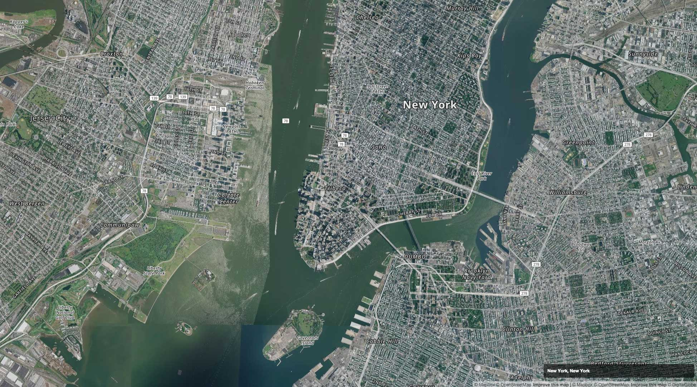

A screensaver that selects a random city and zooms in on various locations around that city.

### Install

**REQUIRED**

* [Download the latest version](https://github.com/Caged/tereshkova/releases) of the [zip file](https://github.com/Caged/tereshkova/releases/download/v1.0/tereshkova.zip)
* [Generate your Mapbox token](https://www.mapbox.com/help/define-access-token/)
* Right click the `tereshkova.saver` file and open [`index.js` to line 5](https://github.com/Caged/tereshkova/blob/4ba5d60d6bc0307aebd35bcc9939a582da2bbc69/tereshkova/index.js#L5) and paste in your personal token.

* Double click the `tereshkova.saver` file

### Change the list of cities

Tereshkova randomly selects from a list of the top 25 most populous world cities (excluding US cities) and the top 50 US cities (Per the list from [natural earth data](http://www.naturalearthdata.com/downloads/10m-cultural-vectors/10m-populated-places/)).  You can change this by right clicking on `tereshokova.saver` and editing [the list of locations](https://github.com/Caged/tereshkova/blob/4ba5d60d6bc0307aebd35bcc9939a582da2bbc69/tereshkova/index.js#L7).

### Change the zoom level
Unfortunately there's no way to get the max zoom level for a particular city.  If you find that too many tiles are missing too often, [edit the easeIn zoom level](https://github.com/Caged/tereshkova/blob/4ba5d60d6bc0307aebd35bcc9939a582da2bbc69/tereshkova/index.js#L96) to a lower value.
